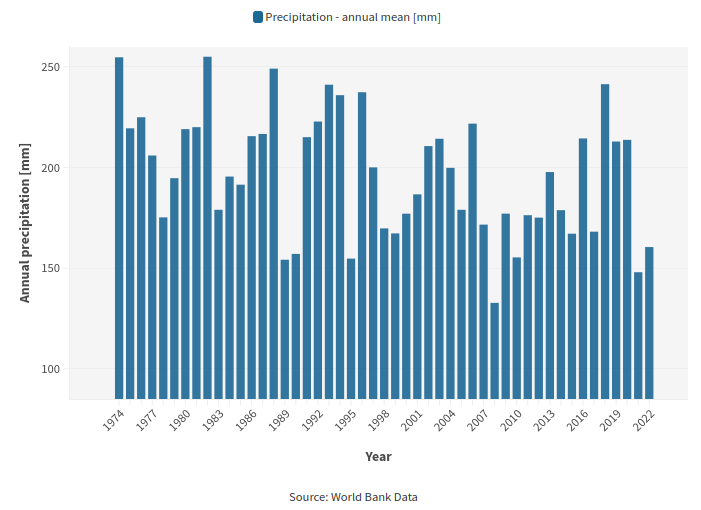

*Personal note*

This blog post is intended to show that Data tells a story. Combining critical thinking with the process of observing, questioning, analyzing, responding and mitigating will allow us to build a better future and overcome future challenges. 

*Introduction*
Desertification is a pressing environmental challenge that affects regions across the globe, with Iraq being no exception. In recent years, rural communities in Iraq have been grappling with the devastating consequences of desertification. Unpredictable weather patterns, limited resources, and a significant decrease in water availability have left farmers struggling to maintain their crops and livelihoods. In this blog entry, we will explore the critical issue of desertification in Iraq, specifically in its rural areas, and discuss the potential benefits of sustainable agriculture as a solution to this growing problem.
The State of Desertification in Iraq
Iraq, with its arid and semi-arid regions, is particularly vulnerable to desertification. In rural communities, the effects of this phenomenon are deeply felt. The primary factors contributing to desertification in Iraq include:
Unpredictable Weather Patterns: Iraq has been experiencing erratic weather patterns in recent years, with prolonged droughts followed by sudden, intense rainfall. These extreme variations in weather make it challenging for farmers to plan and cultivate their crops successfully.
Limited Resources: Many rural farmers in Iraq lack access to modern agricultural technologies, sufficient financial resources, and proper training. These limitations further hinder their ability to adapt to changing conditions.
Declining Water Resources: Water scarcity is a significant concern in Iraq, with the country's water resources having decreased notably over the past 50 years. This decline is attributed to climate change, upstream dam construction and increased demand, creating a severe strain on the agricultural sector.

*The Data*

The chart above shows the annual mean precipitation in Iraq (in mm of rainfall water) in the last 50 years. Climate change is notably affecting the country with a noticeable drop in rainwater by approximately 30% since 1974. 

