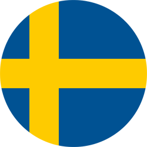

 I work in R&D, storage technologies, Software and Algorithm development, image vision, and data processing in mission-critical applications using ML/AI in automotive, earth observation, and life sciences 

 Ex-CERN. Data Acquisition expert. Design, development, and operation of large-scale and high-throughput data filtering systems (~TB/s). Lead developer and maintainer of mission-critical signal-to-noise data software 

 PhD in Applied Physics specializing in computer engineering and data storage technologies. MSc in Nuclear and Particle Physics 

---
## Short bio, tl;dr

You can mostly find me working on storage technologies, C++ development or performance benchmarking of applications

I like to build, test, and play with the latest technologies. These can range from C++/python libraries, developing home automation applications with Arduino/ESP32 microcontrollers, test linux distros or analyzing large data sets (weather, climate, environment, finance etc.) using (not only) machine learning techniques

 In the past I have worked on:
- <a href="https://www.epj-conferences.org/articles/epjconf/abs/2021/05/epjconf_chep2021_04013/epjconf_chep2021_04013.html">Investigation, benchmarking, market evalution of high-performance storage technologies </a>  (NVMe SSD, persistent memory devices, etc.)
- Research on <a href="https://iopscience.iop.org/article/10.1088/1742-6596/2438/1/012125/pdf/">Sparse Convolutional Neural Networks for particle classification</a> algorithms at CERN
- Development of <a href="https://www.epj-conferences.org/articles/epjconf/abs/2021/05/epjconf_chep2021_04014/epjconf_chep2021_04014.html">data-flow architectures for large-scale data acquisition systems (~TB/s)</a> 
- <a href="https://indico.cern.ch/event/708041/papers/3276145/files/9093-proceedings_Adam_Abed_Abud.pdf/">Performance of distributed file systems</a> for large scale data-flow architectures

I'm a learning enthusiast, I am always looking for the next cool project to work on

Some more details on who I am and what I like ...
<li> I'm originally from Iraq  and I have lived in Italy , Germany , Sweden , France  and Switzerland  </li>
<li> My interests outside of science and computers include bio-hacking, mixing cusines from different places, and reading history</li>

<!--  
-->

<!--  I specialize in <a href="https://github.com/DUNE-DAQ/">Data Acquisition Systems</a> at <a href="https://home.cern/">CERN</a>, mainly focusing on software development and optimization of data intensive applications.
 -->

<!--
-->

---
## Contact
Reach out to me by using any of my social accounts!

<!-- 

  
  
  
  

 -->

<!-- Calendly inline widget begin -->
<!--

-->
<!-- Calendly inline widget end -->

<!--

---
## News

<a class="twitter-timeline" data-width="700" data-height="700" data-theme="light" href="https://x.com/Adam_AbedAbud?ref_src=twsrc%5Etfw">Tweets by Adam_AbedAbud</a>  

-->
