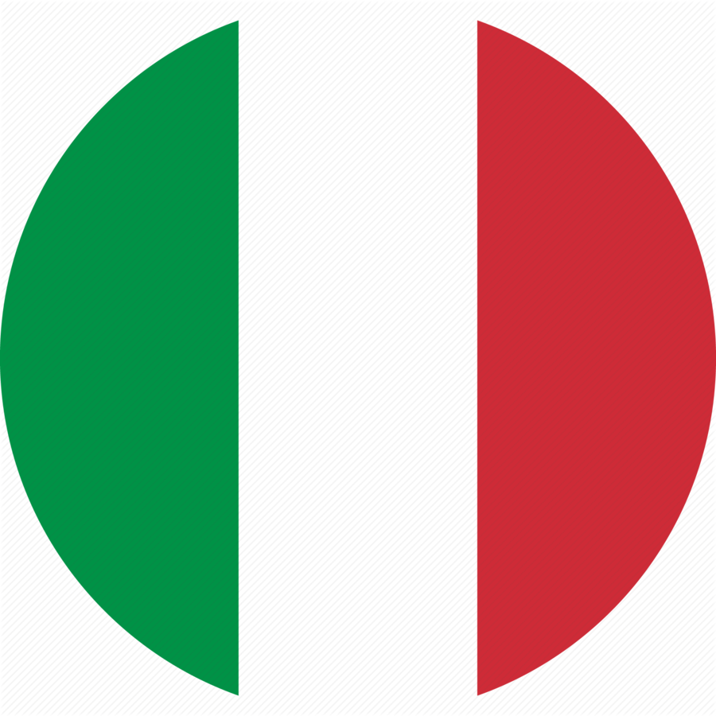
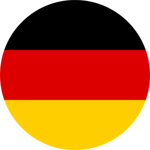
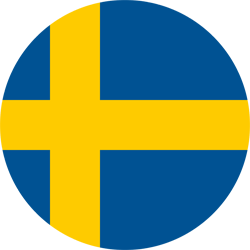
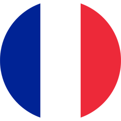

## Short bio, tl;dr

You can mostly find me working on linux, storage technologies, C++ development [(I wrote a guide!)](/assets/pdf/modern_cpp_guide_Adam_Abed_Abud.pdf), building data platforms or benchmarking high-performance applications.

I like to build, test, and play with the latest technologies. These can range from C++/python libraries, developing home automation applications with Arduino/ESP32 microcontrollers, test linux distros or analyzing large data sets (weather, climate, environment, finance etc.) using (not only) machine learning techniques

 I have worked on:
- Novel raw image compression algorithms (<a href="https://thinklucid.com/tech-briefs/sony-imx490-hdr-sensor-and-flicker-mitigation/">nice illustration of some topics I dealt with</a>)
- <a href="https://www.epj-conferences.org/articles/epjconf/abs/2021/05/epjconf_chep2021_04013/epjconf_chep2021_04013.html">Investigation, benchmarking, market evalution of high-performance storage technologies </a>  (NVMe SSD, persistent memory devices, etc.)
- Research on <a href="https://iopscience.iop.org/article/10.1088/1742-6596/2438/1/012125/pdf/">Sparse Convolutional Neural Networks for particle classification</a> algorithms at CERN
- Development of <a href="https://www.epj-conferences.org/articles/epjconf/abs/2021/05/epjconf_chep2021_04014/epjconf_chep2021_04014.html">data-flow architectures for large-scale data acquisition systems (~TB/s)</a> 
- <a href="https://indico.cern.ch/event/708041/papers/3276145/files/9093-proceedings_Adam_Abed_Abud.pdf/">Performance of distributed file systems</a> for large scale data-flow architectures

I'm a learning enthusiast, I am always looking for the next cool project to work on

I'm passionate about business and entrepeneurship. I served as a startup competititon judge in Zurich and I coach companies in B2B, marketing, branding and growth strategies. 

<!-- Some more details on who I am and what I like ...
<li> I'm originally from Iraq  and I have lived in Italy , Germany , Sweden , France  and Switzerland  </li>
<li> My interests outside of science and computers include bio-hacking, mixing cusines from different countries, and reading about history</li> -->

<button
  class="expand-toggle"
  onclick="toggleExpanded('expandedContent', this, 'Read more about my journey →', 'Less details ↑')"
>
  Read more about my journey →
</button>

<button
  class="expand-toggle"
  onclick="toggleExpanded('personalManualContent', this, 'Personal User Manual →', 'Hide Personal User Manual ↑')"
>
  Personal User Manual →
</button>

The idea is modeled on Urs Hölzle’s “Personal User Manual”: a short document that helps others understand how to best work with and interact with me.

- I prefer in-person conversations; async chat messages are also acceptable
- Best for quick (not urgent) questions: Google Chat. For important/urgent matters come and speak to me directly. I will always make time for it
- Peak productivity is in the morning. I’m a morning person🦉
- If we are solving a problem, please share all relevant information. Do not assume anything. Better share the details before the meeting, I prefer to prepare for meetings
- I don’t mind verbose communication in async conversations. I believe it helps understanding the context
- I believe in the 80/20 rule. Let’s get most of the work done and invest the rest in landing the task properly
- I enjoy mentoring and teaching
- I prefer to work in parallel. One core task and at most 2 parallel tasks (if they are self contained). I believe they help me get distracted when stuck on the core problem I’m solving
- Show, don’t tell
- Always curious and hungry to learn something new every day
- Any constructive feedback is welcome
- Always available for a walk-and-talk or coffee/tea to chat about anything

---

Some more details on who I am and what I like ...
I'm originally from Iraq  and I have lived in Italy , Germany , Sweden , France  and Switzerland 

When I'm not coding or optimizing systems, I'm passionate about:

- **Bio-hacking**: I read about human performance through technology, nutrition, and lifestyle changes
- **Kitchen Fusion**: Experimenting with cuisines from different cultures
- **History**: Reading about history, culture and traditions of different countries
- **Hardware Tinkering**: Building home automation systems with Arduino and ESP32, weather stations, RC cars, and more! 

Some more facts about thinks I like (in no particular order): 
- Enjoy picnics 
- Particularly enjoy teaching
- Like One Piece and it’s misteries 
- Enjoy reading 
- Iron man and Batman are my favorite superheroes 
- Rarely watch tv shows
- Like technology 
- Enjoy hummus
- Like robots
- Started making kombucha and fermenting food at home
- Many more things .... 

---

<!--  
-->

<!--  I specialize in <a href="https://github.com/DUNE-DAQ/">Data Acquisition Systems</a> at <a href="https://home.cern/">CERN</a>, mainly focusing on software development and optimization of data intensive applications.
 -->
