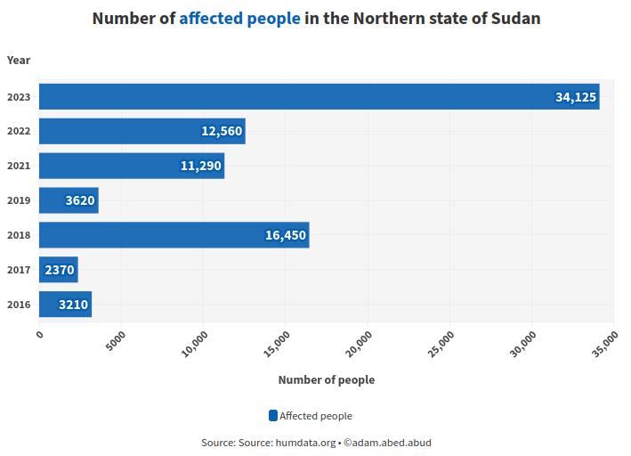

## Introduction

The Nubian people are an indigenous community living in the region that spans across southern Egypt and Sudan. They have a rich cultural heritage that dates back thousands of years. However, in recent years, this community has faced a pressing threat: flooding. The annual rise of the Nile River, coupled with the impact of climate change, has left the Nubian community vulnerable and struggling to cope with the devastating consequences of recurring floods.

## History of the Nubian Community

The Nubian civilization is one of the oldest in the world, with a history dating back to ancient Egypt. Nubians have a unique culture, language, and heritage that have been passed down through generations. Their history is deeply intertwined with the Nile River, which has traditionally been a source of life and livelihood for the Nubian people. The community now mainly resides in the Northern state of Sudan between the city of Wadi Halfa on the Egypt–Sudan border and al Dabbah.

## The problem: 

The Impact of Flooding on the Nubian Community can be summarized in the next 4 main points:

- Displacement and Loss of Homes: The rising waters of the Nile River have led to the displacement of many Nubian families. Their ancestral lands have been inundated, and homes that have been passed down for generations have been destroyed. Families have had to relocate to makeshift shelters, causing immense emotional and economic distress.

- Agricultural Devastation: Agriculture has always been a fundamental part of Nubian life, and flooding has had a catastrophic impact on their crops and livestock. The loss of agricultural livelihoods has pushed Nubian families further into poverty, as they struggle to secure enough food and income to sustain themselves.

- Cultural Erosion: The Nubian community's rich cultural heritage is at risk of erosion due to these frequent floods. Historic sites and artifacts are threatened, and valuable cultural practices and traditions are being disrupted by the upheaval caused by these natural disasters.

- Health and Sanitation Issues: Flooding not only disrupts the Nubian community's daily lives but also poses significant health risks. Contaminated floodwaters can lead to waterborne diseases, and the lack of proper sanitation facilities in temporary shelters exacerbates these concerns.

## Climate Change and Flooding

While the annual flooding of the Nile River is a natural occurrence, climate change has exacerbated the situation in recent years. Rising global temperatures have contributed to more extreme weather patterns, including heavier rainfall and an increased frequency of severe flooding events. Figure 1 shows the increase of the number of people affected by flooding only in the Northern state of Sudan. This puts the Nubian community at even greater risk, as they face the repercussions of a changing climate beyond their control.

Figure 1

## The Need for Assistance and Solutions

The Nubian community’s problems call for immediate attention. There are several key actions that can be pursued to mitigate the mitigate the suffering the community is facing:
Infrastructure Development: Investing in flood-resistant infrastructure, such as levees and embankments, can provide the Nubian community with some protection from rising floodwaters.
Climate Change Mitigation: Addressing the root causes of climate change is essential to reducing the frequency and intensity of flooding in the region. International efforts to combat climate change are crucial to the long-term stability of the Nubian community.
Cultural Preservation: Efforts must be made to document and preserve the Nubian culture and heritage, ensuring that future generations have access to their rich history.

## Conclusion

The Nubian community of South Egypt and Sudan, with its deep cultural heritage and connection to the Nile River, faces immense challenges due to recurrent flooding. The devastating impact of these floods has left many Nubian families displaced and struggling to cope. Addressing this issue requires a multi-faceted approach, including investments in infrastructure, disaster preparedness, and climate change mitigation. As we work together to protect the Nubian community, we also work to preserve the remarkable cultural legacy they represent. It is not only their survival but the preservation of their identity that is at stake.

