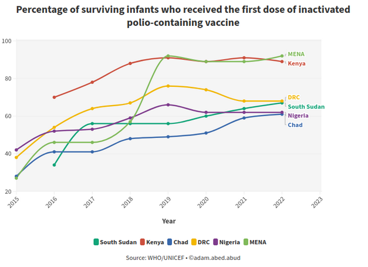

## Introduction

In the relentless pursuit of a polio-free world, the inactivated polio-containing vaccine (IPV) has emerged as a solution in the fight against this debilitating disease. This blog entry highlights the impact of the first dose of IPV on the survival rates of infants, showcasing the strides made toward eradicating polio globally.

## Benefits of Vaccination

Polio, once a global health menace, has seen a remarkable decline in recent decades, thanks to concerted efforts and vaccination campaigns worldwide. At the forefront of this battle is the IPV, a vaccine that has played a crucial role in preventing the spread of poliovirus and safeguarding the health of the youngest members of our communities.

## Data

Recent data regarding the percentage of surviving infants who receive the first dose of IPV paints a promising picture. Across various regions, the correlation between timely vaccination and increased survival rates is evident. This underscores the effectiveness of the vaccine in providing infants with a strong immune foundation against polio.

The impact of the first dose of IPV extends beyond individual protection; it contributes to the larger goal of achieving herd immunity. As more infants receive the vaccine, the transmission of the poliovirus is curtailed, protecting not only those directly vaccinated but also vulnerable individuals within the community.

There are still some challenges in reaching remote areas, especially to overcome vaccine hesitancy. However, the data reflects a resilient global effort to overcome these obstacles. Many countries in Africa have made signficant progress in eradicating the Polio disease in the last 10 years. These include for example: Chad, Nigeria, South Sudan, Kenya, etc. 

There is a noticeable increase for the MENA region. This is partly due to the mass vaccination campaigns in several countries such as Iraq, Syria, Egypt. Link: https://polioeradication.org/news-post/first-mass-vaccination-campaigns-start-since-polio-found-in-iraq/

## Conclusion

While celebrating the progress made, it's crucial to remain vigilant. The final steps toward polio eradication require sustained efforts, funding, and a commitment to reaching every child, regardless of geographical or social barriers. The data serves as both a measure of success and a roadmap for the continued work needed to ensure a polio-free future. 

