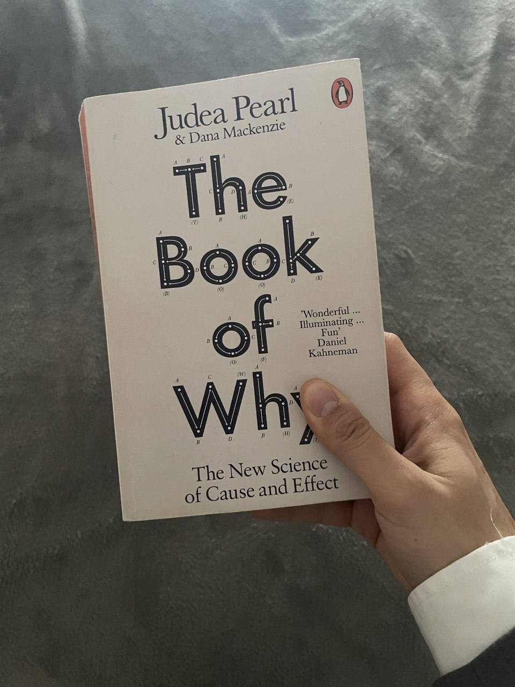

## Introduction:

In the vast world of statistical analysis, where correlations often take center stage, Judea Pearl's "The Book of Why: The New Science of Cause and Effect" stands out. Published in 2018, this book challenges the conventional wisdom in statistics and probability, introducing with rigor the concept of the algebra of causation and emphasizing the paramount importance of causation. This book has been an eye-opener for me and it has definitely encoruaged me to open up again my statistics textbooks. 

In this blog post, I want to make a short summary of the key insights provided by Pearl and explore the transformative impact of his work on various fields, from social sciences to econometrics.

## Causation vs. Correlation:

One of the first tenets of "The Book of Why" is the critical distinction between causation and correlation. While statistical analysis often focuses on identifying relationships between variables, Pearl argues that understanding causation is essential for gaining deeper insights into the underlying mechanisms at play. By understanding such mechanism we can definitely make a leap forward in the knowledge ladder. 

## Algebra of Causation:

At the heart of Pearl's groundbreaking work is the introduction of the algebra of causation and the do-calculus, a formal framework that allows researchers to express and manipulate causal relationships. Unlike traditional statistical methods, which often rely on purely observational data, Pearl's algebra provides a tool for incorporating causal information into statistical models. This approach not only enhances our ability to identify causal relationships but also facilitates the design of interventions and policy decisions based on a solid understanding of cause and effect. Something that I really enjoyed in the book is the wealth of examples, paradoxes and historical insights that are used to describe each of the topics. I didn't know how the laws of causation can play a significant role in explaining well known problems such as for example the Monty Hall paradox. 

## Revolutionizing Statistics and Probability:

"The Book of Why" has far-reaching implications for fields such as social sciences and econometrics. In social sciences, where complex systems and human behavior are often difficult to untangle, the ability to discern causation from correlation can lead to more accurate and effective interventions. A classic excample is whether smoking causes lung cancer or not. Another interesting field is econometrics. This field benefits from Pearl's framework, offering economists the tools to better understand the causal links between economic variables and make more informed policy recommendations. You can think of applying such tools and methodologies 

## Conclusion:

Pearl's work challenges the traditional statistical paradigm, where correlation has long been the primary focus. By placing causation at the forefront, "The Book of Why" opens new avenues for researchers to explore the intricate web of cause-and-effect relationships underlying observed data. This shift in perspective has the potential to reshape statistical methodologies and deepen our understanding of complex phenomena across various disciplines. The implications of this revolutionary change extend far beyond the realm of academic research, impacting fields ranging from social sciences to econometrics. As we continue to explore the intricate tapestry of causation, Pearl's work serves as a guide and definitely a must read to get into the basics of this fascinating topic.

