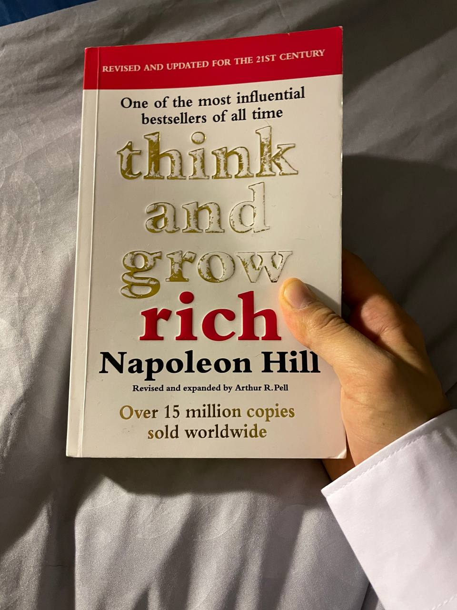

# Review of "Think and Grow Rich" by Napoleon Hill

In this blog post, I want to make a short summary of what I learned from the book Think and Grow Rich by Napoleon Hill. In my opinion, this is a timeless guide to success with a lot of useful suggestions and tips on how to succeed in business but most importantly how not to fail.

First of all, one of the strengths of the book is the emphasis on the power of the mind. The author spends a major part to explain how the mind plays a crucial role as guiding force for one's actions. The author argues that a focused and determined mind can overcome obstacles and attract opportunities, creating a blueprint for success. The book is not just about accumulating wealth but also about achieving any form of personal or professional success.

The thirteen principles outlined in the book include desire, faith, persistence, and the mastermind. They are described as a means that serve as a comprehensive framework for individuals seeking to transform their lives. Hill supports these principles with real-life examples, anecdotes, and case studies of successful individuals such as Thomas Edison, Henry Ford or other successful entrepreneurs.

The author also emphasizes a lot on the importance of positive thinking and the subconscious mind. Readers will find practical exercises and affirmations throughout the book, encouraging them to implement these strategies in their daily lives. In fact, there are chapters fully dedicated to these topics. I found them really useful.

In conclusion, although some people may think that the book "Think and Grow Rich" is a bit outdated because it shows old types of successful businesses (e.g. the steel corporation in the US) I believe the values and the lessons taught are quite relevant in today's age. I found this book very useful and I would definitely consider it a timeless masterpiece.

