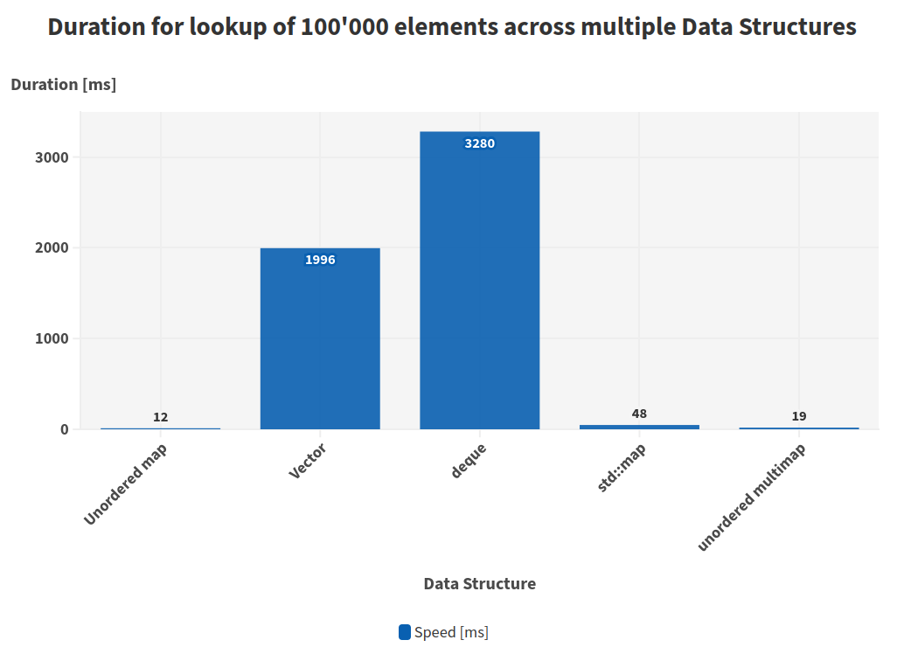

When it comes to designing and implementing data structures in C++, developers often find themselves facing critical decisions about which container type to use for optimal performance. In this blog post, I want to benchmark different C++ Data Structures and assess which ones have the fastest lookup speed. This problem comes from a task that I had to do for work when evaluating the data structures that holds different network connections. I will use the same benchmarking code snippet for the different data structures and, obviously, the same logic for testing.


## Starting point: Unordered map

We start with a simple C++ code that measures the insertion speed into an std::unordered_map. The code generates random strings as keys and inserts corresponding values into the map. It then performs a large number of lookups to gauge the efficiency of the data structure.

```cpp
#include <unordered_map>
#include <chrono>
#include <iostream>
#include <random>
#include <string>
#include <map>

// Dummy structure to use as value in map
struct ConnectionID
{
    std::string a;
    std::string b;
    int c;
};

// Get a random string of length `length` to use as a map key
std::string random_string(int length)
{
    static std::default_random_engine engine(12345);
    static std::uniform_int_distribution<char> uniform_dist('a', 'z');

    std::string ret;
    for(int i=0; i<length; ++i){
        ret+=uniform_dist(engine);
    }
    return ret;
}


int main(int /* argc */, char** /* argv */)
{
    // The number of entries in the map
    const int n_values = 1000;
    // The length of each string key in the map  
    const int key_length = 100;
    // The number of map lookups to do in the benchmarking step
    const int n_lookups = 1000'000;

    std::vector<std::string> keys;
    std::map<std::string, ConnectionID> hashmap;

    std::default_random_engine engine(123456);
    std::uniform_int_distribution<int> uniform_dist(0, n_values-1);

    // Insert random values into the map
    for(int i=0; i<n_values; ++i){
        std::string key=random_string(key_length);
        keys.push_back(key);
        hashmap[key]=ConnectionID{random_string(3), random_string(4), uniform_dist(engine)};
    }

    
    // Sum up the integer members of the looked-up values in the map
    // to make sure the optimizer doesn't turn the loop into a no-op
    int total = 0;

    // Pick a random array of indexes to look up
    std::vector<int> key_indexes_for_lookup;
    std::uniform_int_distribution<int> uniform_dist2(0, n_values-1);
    for(int idx=0; idx < n_lookups; ++idx){
        int which_key = uniform_dist2(engine);
        key_indexes_for_lookup.push_back(which_key);
    }
    
    
    // Do the actual lookups
    auto start = std::chrono::steady_clock::now();
    for(int i=0; i<n_lookups; ++i){
        const std::string& key = keys[ key_indexes_for_lookup[i] ];
        const ConnectionID& conn_id = hashmap[key];
        total += conn_id.c;
    }    
    auto end = std::chrono::steady_clock::now();
    std::cout << total << std::endl;
    auto const ms = std::chrono::duration_cast<std::chrono::milliseconds>(end-start).count();
    float MHz = 1e-3*n_lookups/ms;
    std::cout << "Did " << n_lookups << " lookups in " << ms << "ms. " << MHz << "MHz" << std::endl;
    
}
```

The first part of the code defines the data structure that we want to use for the key and value for the lookup process. In this case I wanted to use something more realistic for the value and I opted for a `struct ConnectionID` that has three entries (e.g. source IP, destination IP and an integer). For the key I used a simple `string` generated with a function `random_string` that creates a string with a `uniform_dist` and with a configurable key length. Once the data structure is created and filled with the number of keys (configurable quantity), I perform the `lookup` operation and measure the time taken for it. 

```cpp
    // Do the actual lookups
    auto start = std::chrono::steady_clock::now();
    for(int i=0; i<n_lookups; ++i){
        const std::string& key = keys[ key_indexes_for_lookup[i] ];
        const ConnectionID& conn_id = hashmap[key];
        total += conn_id.c;
    }    
    auto end = std::chrono::steady_clock::now();
```


## std::map

Let's look now at a different data structure: std::map.  This is an ordered associative container that mainteins a sorted order of the elements based on keys. In this case the code looks the same but simply the declaration of the data structure changes: 

```cpp
#include <map>

int main() {
    std::map<std::string, ConnectionID> ordered_map;
    // ... (rest of the code remains the same)
}
```


## std::vector

For the vector implementation I wanted to do something a bit different (and weird). I created a Data Structure that holds the key and value inside an std::vector. Here is the code: 

```cpp

class VectorMap {
public:
    std::vector<std::pair<std::string, ConnectionID>> vector_map;

    void EmplaceBack(std::string key, ConnectionID id) {
        vector_map.emplace_back(key, id); //

    }


    // Function to access elements using the key
    ConnectionID& operator[](const std::string& key) {
        for (auto& pair : vector_map) {
            if (pair.first == key) {
                return pair.second;
            }
        }
    }

    void sort() {
        std::sort(vector_map.begin(), vector_map.end(), [](const auto& a, const auto& b) { return a.first < b.first; });
    }

};
```

The rest of the code is very much the same. You can check it on the [Github link](https://github.com/adam-abed-abud/data_structure_lookup_performance) for more details. 

## std::unordered_multimap 

The unordered multimap is very much similar to the map but it has a much lower performance. The only difference for our current application is how to declare the structure:

```cpp
#include <unordered_map>

int main() {
    std::unordered_multimap<std::string, ConnectionID> multimap;
    // ... (rest of the code remains the same)
}
```


## std::deque 

Lastly, we investigate the use of a std::deque as an alternative container. Elements are inserted into the deque, and a linear search is performed for lookups. Here the code is very much similar to the vector one:

```cpp
class DeQue {
public:
    std::deque<std::pair<std::string, ConnectionID>> deque_map;

    void EmplaceBack(std::string key, ConnectionID id) {
        deque_map.emplace_back(key, id); //

    }


    // Function to access elements using the key
    ConnectionID& operator[](const std::string& key) {
        for (auto& pair : deque_map) {
            if (pair.first == key) {
                return pair.second;
            }
        }
    }
};
```


## Analyzing the results

For each data structure, we measure the time taken to perform the insertions and subsequent lookups. We use 100'000 lookups. The results are presented in terms of milliseconds and MHz (mega-insertions per second). Here is a summary table: 

| Data structure     | Number of elements for lookup | Speed [ms] | Rate [MHz]  |
| ------------------ | ----------------------------- | ---------- | ----------- |
| Unordered map      | 100000                        | 12         | 8.33333     |
| std::map           | 100000                        | 48         | 2.08333     |
| Vector             | 100000                        | 1996       | 0.000501002 |
| unordered multimap | 100000                        | 19         | 5.26316     |
| deque              | 100000                        | 3280       | 0.000304878 |


And here is a histogram of the results: 




## Conclusion

As it can be noted the fastest data structure is the `unordered map` (who would have guessed?). In any case it was fun to play around with different data structures such as the deque (by far the slowest)  and unordered multimaps. 

## PS 
I use [Compiler Explorer](https://godbolt.org/) to test and prototype code in C++. 

